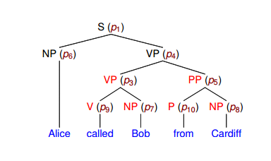
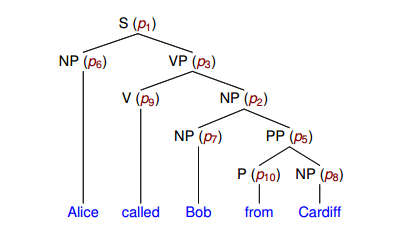

# Trabajo Práctico 3
##### Nicolazzi Robertino, 2017, FaMAF

#### Ejercicio 1: Evaluación de Parsers

Se compara el parsing realizado por cada modelo con el parseo "gold", el cual seria el "correcto",
que viene dentro de ancora.

Se obtienen las metricas de precision, recall y F1 para Labeled y Unlabeled

Flat: 1444 sentences
|Labeled|
|-------|
|  Precision: 99.93% |
|  Recall: 14.58% |
|  F1: 25.44% |

|UnLabeled|
|------|
|  Precision: 100.00% |
|  Recall: 14.59% |
|  F1: 25.46% |

Tiempo Evaluación: 0m9.276s

RBranch: 1444 sentences
|Labeled
|-
|Precision: 8.81% 
|  Recall: 14.58% 
|  F1: 10.98% 

|UnLabeled
|-
|Precision: 8.88% 
|  Recall: 14.69% 
|  F1: 11.07% 

Tiempo Evaluación:  0m9.907s

#### Ejercicio 2 CKY
En un diccionado se indexa utilizando la parte derecha de la producción, donde cada item tiene un diccionario donde se guarda la parte izquierda de la producción con su respectiva probabilidad logarítmica.
Luego este diccionado tambien se utiliza para obtener los X tal que la parte derecha de la produccion sea YZ es decir buscamos X-->YZ sin la necesidad de recorrer todos los no terminales.
De esta forma se contruye la un diccionario para la tabla pi y los backpointers

##### Oración ambigua agregada
'Alice called Bob from Cardiff'
Podemos interpretar que alicia llam oa bob, ella estando en Cardiff o que alicia llamo a un tal bob el cual se encuentra en cardiff

Con esta gramatica elegimos el árbol de la derecha
S -> NP VP      [1.0]
NP -> NP PP     [0.25] 
VP -> V NP      [0.40] 
VP -> VP PP     [0.60]
PP -> P NP      [1.0]
NP -> 'Alice'   [0.25] 
NP -> 'Bob'     [0.25] 
NP -> 'Cardiff' [0.25] 
V -> 'called'   [1.0]
P -> 'from'     [1.0]

#### Ejercicio 3: UPCFG

Por cada árbol proveniente de las oraciones parseadas, se lo deslexicaliza y se lo 
convierte en Chomsky Normal Form y eliminando las formas unarias, para luego obtener las producciones 
para generar un PCFG

Para parsear se utiliza CKY implementado en el ejercicio 2. Luego el árbol generado
por el parser se lexicaliza y se lo vuelve a la forma original (Se deshace el Chomsky Normal form).
En caso que el parser no devuelva un árbol valida, se devuelve un árbol plano

Parsed 1444 sentences
|Labeled
|-
|Precision: 72.59% 
|  Recall: 72.44% 
|  F1: 72.51% 

|UnLabeled
|-
| Precision: 74.76% 
|  Recall: 74.61% 
|  F1: 74.69% 

Tiempo evaluación:  7m50.845s

#### Ejercicio 4: Markovizacion Horizontal

Para implementar la markovizacion horizontal unicamente se pasa el valor del parametro 
que determina el grado de markovizacion en la función para transformar el árbol
en Chomsky Normal Form

n = 0

|Labeled
|-
| Precision: 69.71% 
 | Recall: 69.78% 
 | F1: 69.75% 

|UnLabeled
|-
|Precision: 71.61% 
|  Recall: 71.68% 
|  F1: 71.65% 

Tiempo evaluación:  2m26.770s

n = 1

|Labeled
|-
|Precision: 74.20% 
|  Recall: 74.21% 
|  F1: 74.21% 

|UnLabeled
|-
|Precision: 76.26% 
|  Recall: 76.27% 
|  F1: 76.27% 

Tiempo evaluación: 3m9.357s

n = 2

|Labeled
|-
|Precision: 74.58% 
|  Recall: 74.13% 
|  F1: 74.35% 

|UnLabeled
|-
|Precision: 76.59% 
|  Recall: 76.13% 
|  F1: 76.36% 

Tiempo evaluación:  5m32.338s

n = 3

|Labeled
|-
|Precision: 73.74% 
|  Recall: 73.11% 
|  F1: 73.42% 

|UnLabeled
|-
|Precision: 75.88% 
|  Recall: 75.23% 
|  F1: 75.55% 

Tiempo evaluación:  6m31.420s

